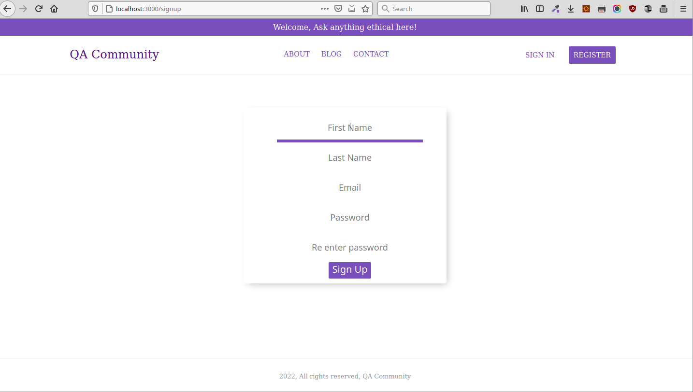
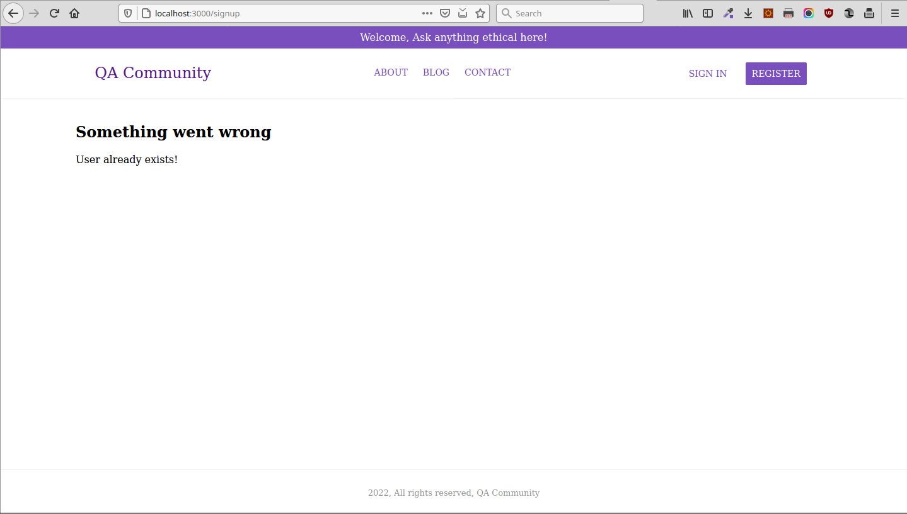
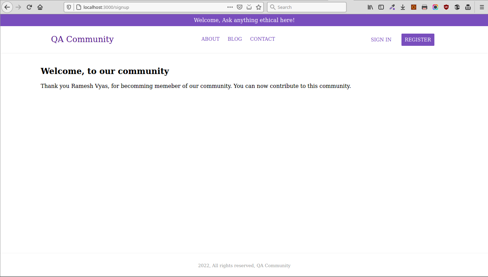
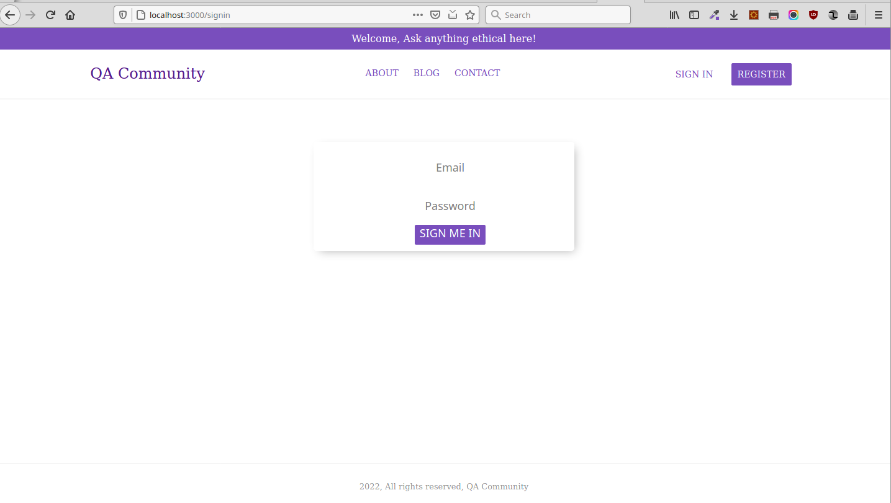
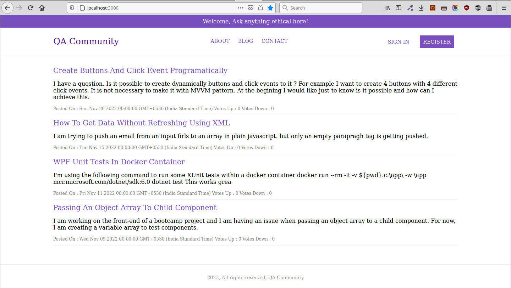
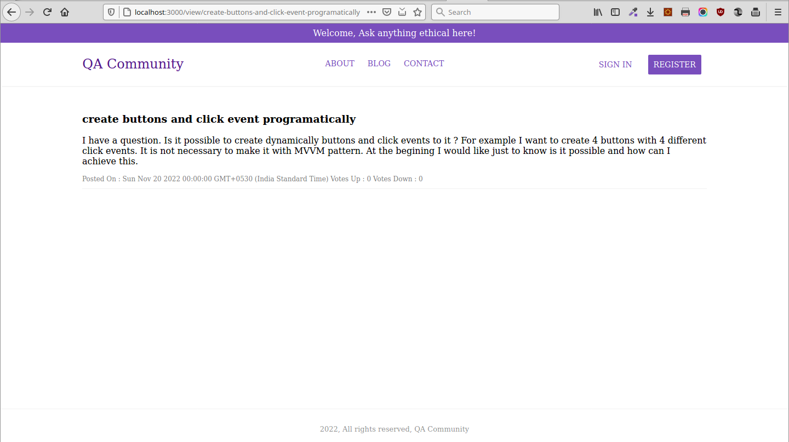

# QACommunity_NodeJS
## Simple Nodejs application for Question and answer community

Following are some screen shots of the application showing how it looks and works.

(Sign Up Form)

(User exists error)

(Sign up success message)

(Sign in / Login Page)

(Login Error)

(Login Error)

(All questions)

(Question Detail View with slug as parameter)